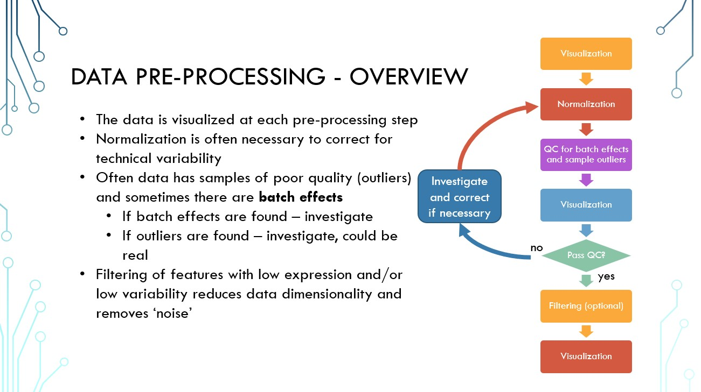

# Preprocessing data

**Standard as of:** _pending approval_

## Overview

## Steps
1. Import and format data
	* Data should be formatted with miRNA/mRNA as rows, samples/patients as columns
1. Find batch numbers
	* Batch numbers in TCGA data can be found from the sample barcode
	* All visualizations should show batches
1. Normalize by relative frequency
	* Find the total mRNA/miRNA expressed in each sample and divide each count by that sum
	* Results in each mRNA/miRNA shown as a fraction of total expression
	* Can use [SampleNormalizationRF](./helper_functions/SampleNormalizationRF.m) function
	* __Visualize__: Boxplot recommended
1. Log2 transform
	* Will likely need to remove zeroes
		* Can use [replaceZeros](./helper_functions/replaceZeros.m) function with `lowval` option
	* __Visualize__: Boxplot recommended
1. Identify outlier threshold 
	* [computeAlphaOutliers](./helper_functions/computeAlphaOutliers.m) function can be used to identify α
	* based on [Hoaglin & Iglewicz](http://www.doi.org/10.2307/2289392)
	* outlier threshold depends on sample size. __*Recalculate each time the sample size changes due to removal of outliers etc.*__
1. Find interquartile range of expression 
	* Find [IQR](http://www.mathworks.com/help/stats/prob.normaldistribution.iqr.html) of filtered data
	* Identify outliers
	* __Visualize__: Scatter plot recommended
1. Find mean Spearman correlation
	* Calculate mean Spearman correlation of each sample to all other samples
	* Can use [SampleCorrelation](../helper_functions/SampleCorrelation.m)
	* Identify outliers
	* __Visualize__: Scatter plot recommended
1. Cluster
	* Create a [clustergram](http://www.mathworks.com/help/bioinfo/ref/clustergram.html)
	* Identify samples that cluster on their own
1. Remove outliers
1. If outliers are removed, __*repeat preprocessing with outliers removed*__
	* __Note__: After the first pass of preprocessing, relative frequency normalization and log2 transformation are unnecessary a second time (go back to step 5)
1. Filter for 90th percentile of expression
	* Filter out mRNA/miRNA that are not expressed above the 90th percentile
	* Can use [FilterLowCounts](./helper_functions/FilterLowCounts.m) function to identify lowly expressed features
	* __Visualize__: Boxplot recommended
1. Export data

## Notes
* The [make_boxplot](./helper_functions/make_boxplot.m) function can be helpful for labeled boxplots
* The [scatter\_plot\_mark\_outliers](./helper_functions/scatter_plot_mark_outliers.m) function plots data and identifies outliers